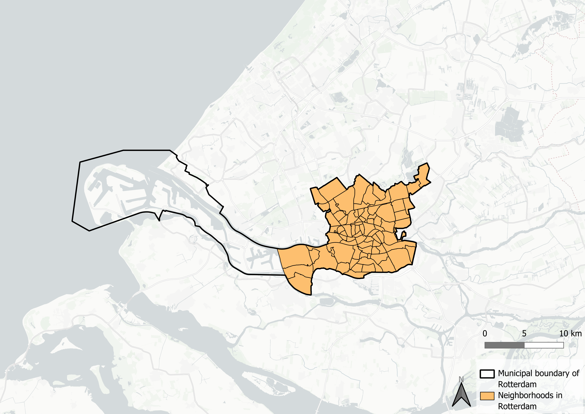
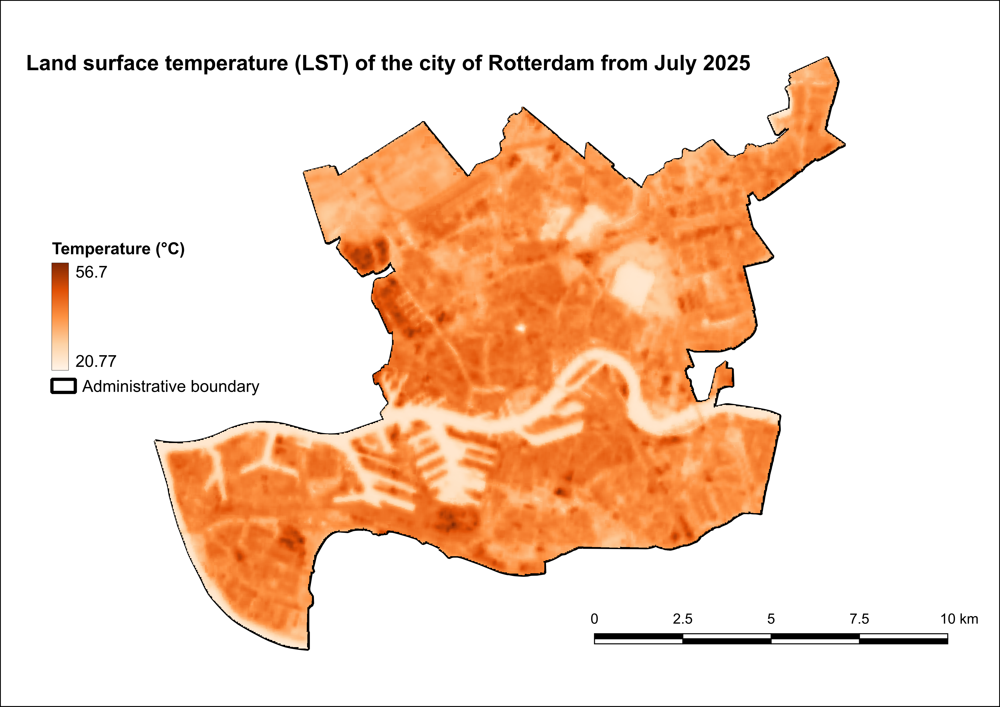
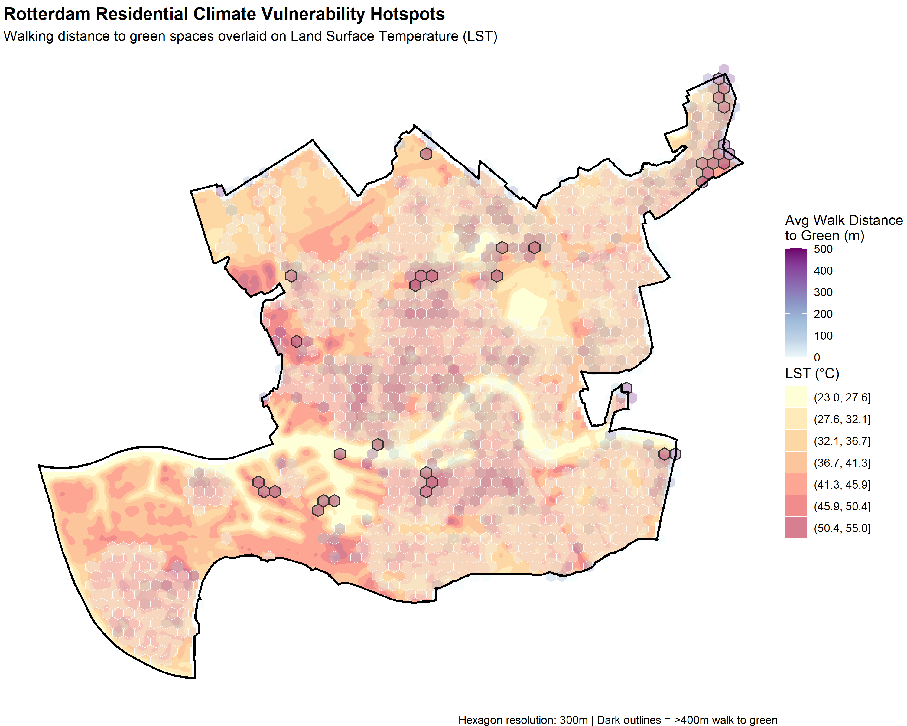
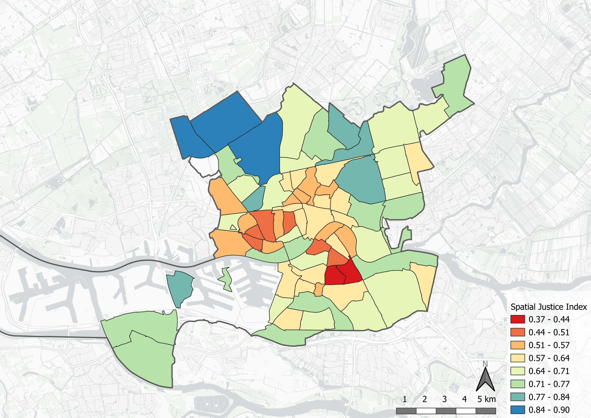
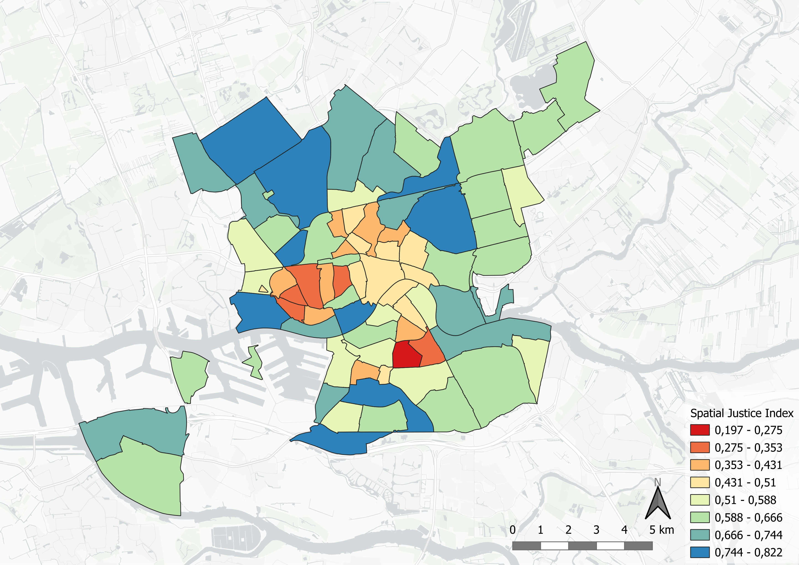
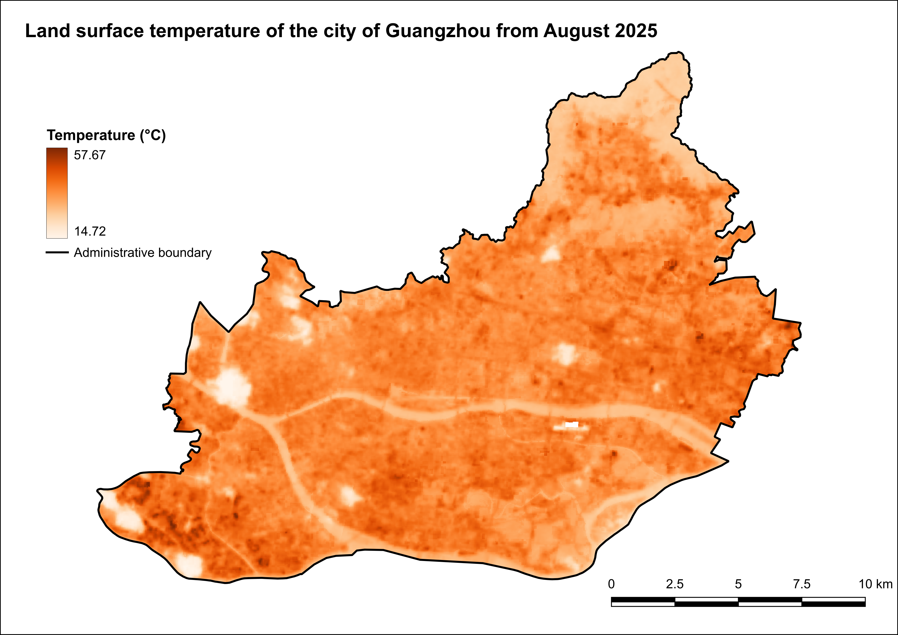
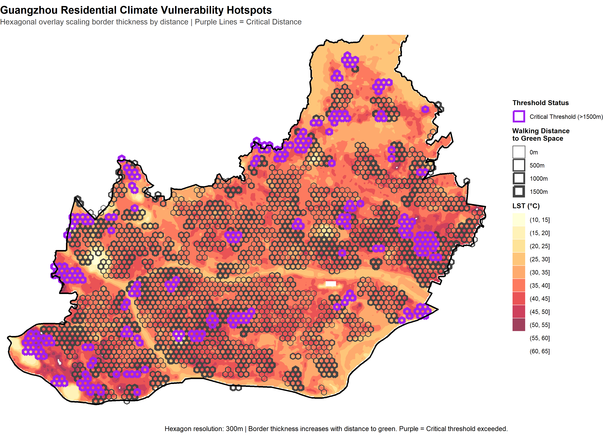

# Introduction

Urban environments are increasingly vulnerable to the impacts of climate change, particularly the intensification of the Urban Heat Island (UHI) effect. @wong-2016 suggest that urban thermal stress is often unevenly distributed across municipal populations, with spatial justice metrics -such as proximity to cooling urban green spaces- aligning with socio-economic disparities. In many metropolitan contexts, lower-income or socially vulnerable populations are often concentrated within dense, highly paved urban cores, potentially exposing them to elevated thermal conditions and associated health risks [@wong-2016]. This intersection of micro-climate variation and social equity forms an important challenge for modern urban planning.

As municipal governments seek to adapt, the expansion of urban green infrastructure has emerged as a strategy to mitigate the UHI effect and establish cooling zones. However, assessing whether these interventions genuinely protect vulnerable communities requires a comparative analysis across different urban environments. This research examines the inequality in climate impact between two cities operating on vastly different geographical, demographic, and administrative scales: Rotterdam, a compact European port city, and Guangzhou, a large, dense subtropical city. By comparing these distinct urban frameworks, this study investigates whether the link between socio-economic vulnerability and high heat exposure functions as a universal urban pattern, or if it varies significantly based on local climate zones and governance models. Ultimately, this report aims to evaluate the systemic equity of current climate adaptation strategies by addressing the following primary research question:

> *How does the relationship between urban green infrastructure allocation and socio-economic vulnerability vary between Rotterdam and Guangzhou?*

In order to get a clear answer to this question, the primary query is divided into two sub-questions;

1.  How do the physical and socio-economic criteria of spatial justice correlate with the Land Surface Temperature in each city?
2.  Which neighborhoods exhibit the highest deficit in environmental amenities relative to their vulnerability index, identifying them as priority zones for green adaptation?

This report will first discuss the methodology used to perform the research in both study areas. Secondly, the results for Rotterdam and Guangzhou are presented individually. The subsequent discussion section covers limitations of the data, addresses spatial uncertainties, and directly contrasts findings between the two target cities. Ultimately, the research question is answered in the concluding section, alongside recommendations for equitable urban planning.

# Methodology

To evaluate the relationship between urban green infrastructure allocation and socio-economic vulnerability, this study bridges urban climate and social equity by quantifying the land surface temperature (LST) distribution alongside a Spatial Justice Index, which includes several metrics of spatial justice. The methodology is structured as follows: defining the metrics for measuring LST and spatial justice, explaining the data sources used for the analysis, and integrating these dimensions through a Multi-Criteria Decision Analysis (MCDA) framework.

As @bartesaghi-koc-2020 describe, the UHI effect is a phenomenon where urban areas experience higher temperatures than their rural surroundings. This is driven by the built environment, which absorbs and retains heat, and is exacerbated by a lack of urban vegetation, which reduces potential cooling from evapotranspiration and shading. Consequently, the presence of green infrastructure is a key factor in mitigating UHI [@bartesaghi-koc-2020].

According to @dadashpoor-2025, spatial justice concerns the fair distribution of resources, services, and environmental benefits across urban space. Therefore, spatial justice can be measured in multiple ways, including socio-economic indicators, such as income, education, and employment, as well as access to green spaces. This study focuses on socio-economic aspects and access to green spaces which can be connected to the LST distribution. By combining these metrics through a Multi-Criteria Decision Analysis (MCDA) framework, the relation between urban climate and spatial justice can be evaluated and compared for Rotterdam and Guangzhou.

## Metrics

<!-- Explain the metrics that will answer the research question -->
- Scale - We settled on using a scale of 1:110000 for both Rotterdam and Guangzhou's city extents so that the comparison analysis is harmonized on exclusively one common scale. 
- LST - To assess the urban micro-climate, Land Surface Temperature (LST) maps were generated for both cities using sattelite imagery from Landsat-8 and Lndsat-9. For Rotterdam, imagery from July 2025, and for Guangzhou, imagery from August 2025 was acquired. We wanted to pick the hottest times of the year to measure the impact of the LST at its highest values. Picking out datasets with unobstructed view of the city extents was heavily dependent on the availability of satellite imagery for the specific period we wanted.
The spatial analysis was conducted by first clipping the raster datasets to the respective study area boundary polygons using a mask layer. To convert the raw Digital Number (DN) values into meaningful temperature readings, the standard USGS scale factor was applied to calculate the temperature in Kelvin:
$$T_{K}={DN * 0.0341802 + 149.0}$$


Subsequently, the Kelvin values were converted to degrees Celsius using the following formula:
$$T_{∘C}= {T_{K} - 273.15}$$

- Spatial justice metrics - ...

- Distance to green - ...

To measure social equity, we used spatial justice metrics like income and distance to green spaces...

## Data Sources {#sec-data-sources}

For both Rotterdam and Guangzhou, the analysis relies on a combination of spatial and socio-economic datasets.
The LST data for Guangzhou and Rotterdam was obtained by downloading Landsat 8/9 Collection 2 Level-2 Surface Temperature satellite imagery (ST_B10) using the *USGS Earth Explorer* [@usgsee-2026]. The data for Rotterdam is from the month of July 2025, and for Guangzhou, it its from August 2025. We wanted to pick the hottest times of the year to measure the impact of the LST at its highest values. It is important to point out that picking out datasets with unobstructed view of the city extents was heavily dependent on the availability of satellite imagery for the specific period we wanted.

For Rotterdam, data was primarily sourced from the *Leefbaarometer 2024* [@leefbarometer-2026] and *CBS Buurtgegevens [@cbs-2026]* , which provide comprehensive neighborhood-level information on physical livability, social cohesion, housing conditions, and demographic characteristics. These datasets are complemented by high-resolution Land Surface Temperature (LST) data derived from satellite imagery, enabling precise mapping of urban heat distribution. Because distance to green is an important indicator in Spatial Justice, a network analysis was performed using building data from the *BAG*, obtained via the PDOK plugin in QGIS [@pdok-2026], and road networks and green areas from *OpenStreetMap (OSM)* [@OpenStreetMap]*.*

For Guangzhou, data acquisition posed a greater challenge due to limited availability of granular socio-economic information. Consequently, the analysis utilized *OSM* data to extract residential land use and green space locations, supplemented by pedestrian network data to assess accessibility. LST data for Guangzhou was obtained from remote sensing sources, ensuring methodological consistency with the Rotterdam dataset. Population distribution for Guangzhou was modelled using open-source data from "WorldPop.org" [@worldpop-2026]. However, because *WorldPop* is a gridded global dataset, it may lack the localized accuracy of official census products like the Dutch CBS data. Despite these variations in source material, the integration of these datasets allows for a robust cross-city comparison of spatial justice and urban climate vulnerability.

To ensure a valid comparative analysis between the two distinct urban contexts, uniform metrics were applied to both cities. Because data availability for Rotterdam significantly outpaced that of Guangzhou, the scope of the Rotterdam analysis was intentionally restricted to align with the indicators available for Guangzhou. Omitting these higher-resolution variables for Rotterdam represents a deliberate methodological limitation of this study, accepted in favor of cross-city comparability.

## Multi-Criteria Decision Analysis

Multi-Criteria Decision Analysis (MCDA) is a structured evaluation framework used to solve complex decision and spatial planning problems that involve multiple criteria. As highlighted in a review by @huang-2011, MCDA has seen accelerating growth in environmental and strategic planning because it provides a transparent, technically valid framework to balance technical data against diverse stakeholder values. The methodology relies on decomposing a complex problem into measurable criteria, normalizing heterogeneous data to a common scale, applying explicit weights that reflect strategic priorities, and aggregating the results to rank or score geographic alternatives.

Evaluating spatial justice and urban climate adaptation cannot be achieved through a single metric; it requires balancing socio-economic vulnerabilities against environmental and physical urban characteristics. According to @dadashpoor-2025, spatial justice is an inherently multidimensional, dynamic concept encompassing categories such as equal access, equity, diversity, and public participation. To analyze these intersecting dimensions simultaneously, a flexible, integrative approach is necessary. MCDA allows for this integration by transforming diverse datasets into a uniform, dimensionless scale. Furthermore, by embedding priorities into the mathematical model via weighting, researchers can directly reflect the equity and need-based distribution dimension emphasized by @dadashpoor-2025, ensuring that final spatial interventions prioritize structurally disadvantaged or vulnerable urban areas.

The operational workflow for the Spatial Justice Index was executed in four sequential phases: criteria selection, data normalization, weight assignment, and aggregation. To construct a comprehensive Spatial Justice Index, MCDA provided the mechanisms to normalize all heterogeneous indicators and assign strategic weights to each criterion.

## Analytical Workflow and Comparative Framework

To ensure a structured and symmetrical cross-city comparison, the analysis for both Rotterdam and Guangzhou follows an identical three-phase analytical pipeline:

1.  Thermal and Physical Amenity Correlation: First, high-resolution Land Surface Temperature (LST) distributions are mapped and directly correlated against physical walking distances to urban green spaces. This establishes the baseline relationship between micro-climate intensity and physical access in each urban context.
2.  Index Calibration: Second, the Spatial Justice Index (SJI) is generated. For Rotterdam, two variations are calculated -a complete model leveraging the full depth of available Dutch socio-economic data, and a simplified model restricted to baseline indicators. For Guangzhou, the simplified model is executed using harmonized proxies to ensure exact cross-city compatability.
3.  Synthesis and Equity Mapping: Finally, the generated Spatial Justice Indices are cross-analyzed against the LST layers. This synthesis produces final overlay maps that explicitly identify "priority zones" -neighborhoods where high socio-economic vulnerability, structural green deficits, and elevated thermal stress intersect.

## Reproducibility

To ensure the transparency, verifiability, and replicability of this comparative study, all analytical scripts have been made openly available, and the primary data sources are fully documented. The empirical analysis relies entirely on open-access spatial and alphanumeric datasets. Researchers wishing to replicate this study can acquire the baseline data from the data sources linked in @sec-data-sources. Some of these datasets are already available in the `/data` folder of the repository.

The analytical pipeline is executed entirely via open-source R scripts, organized within the `/code` folder of the repository. Because raw source data are not pre-packaged in the repository, users must download the datasets from the links in @sec-data-sources and format them to match the expected directory inputs.

- Spatial Justice Index (SJI) Calculation: The R scripts execute the normalization, weighting, and multi-criteria aggregation of the spatial justice indicators. To maintain analytical rigor while ensuring cross-city validity, the codebase provides two separate tracks: a script for the complete, high-resolution SJI of Rotterdam, and a simplified SJI script calibrated specifically to match the baseline data indicators common to both Rotterdam and Guangzhou.

- Network Analysis and Visualization: A separate network analysis script ingests the residential layers and green space polygons. It computes walking distances along the extracted pedestrian infrastructure, aggregates these accessibility metrics into a uniform hexagonal grid, and automatically plots the resulting deficit zones directly over the Land Surface Temperature (LST) raster layer.

# Results: Rotterdam Case Study

The analysis begins with Rotterdam, a compact European port city characterized by distinct post-war urban planning, high industrial infrastructure, and a maritime climate. This section provides a localized evaluation of how spatial justice metrics intersect with urban climate vulnerability across the municipality.

A significant advantage of examining the Dutch urban context is the broad availability and high granularity of open-source data. Databases such as the *Centraal Bureau voor de Statistiek* (CBS) and the *Leefbaarometer* provide extensive, neighborhood-level insights into physical livability, social cohesion, demographics, and socioeconomic status. This rich data landscape enables a highly detailed evaluation of spatial equity.

However, applying this data across the entire administrative boundary of Rotterdam requires boundary delimitation. The extensive Port of Rotterdam area, while geographically vast, contains heavily industrialized fabric with little to no permanent residential population. Including these industrial zones would skew the statistical distributions of both the Land Surface Temperature (LST) and socio-economic vulnerability indices, rendering them unrepresentative of actual civilian exposure. Consequently, this study restricts its spatial scope to Rotterdam's residential and central urban neighborhoods (@fig-buurten-rotterdam), to ensure an accurate reflection of human-centric environmental exposure.

{#fig-buurten-rotterdam fig-align="center"}

## Land Surface Temperature

After deriving the land surface temperature for Rotterdam, the results showcased in the figure below are clearly defined. Lighter areas correspond to larger green areas and the water bodies in the city extent. In contrast, the darker areas correspond to places such as industrial zones and inner ports of Rotterdam, which are the biggest contributor of extreme LST values on the map:
{#fig-lst-rdm fig-align="center"}

## Climate Vulnerability

To map localized climate vulnerability, this analysis intersects physical exposure to extreme heat with the availability of environmental mitigation measures. Specifically, the Land Surface Temperature (LST) is compared against the pedestrian walking distance to urban green spaces, which serve as crucial cooling amenities during extreme heat events. Examining this relationship reveals whether structural deficits in urban cooling infrastructure are concentrated in the areas facing the highest thermal stress.

The spatial workflow establishes these metrics by executing a pedestrian network analysis. Residential building footprints (*woonfunctie*) are isolated to serve as origin nodes, which are then routed along the local road and pedestrian network layers to calculate the walking distance to the nearest designated green space destination. To ensure a standardized, continuous unit of analysis, the network routing results are aggregated into a 150-meter hexagonal grid, calculating the average walking distance from the enclosed buildings to the nearest cool space. Concurrently, the satellite-derived LST raster map is reprojected and cropped to match the city's residential extent.

Based on the spatial distributions shown in @fig-rot-green-lst, there is no clear correlation between physical distance to green spaces and LST in Rotterdam. The most vulnerable residential clusters in terms of green space accessibility are distributed across both high-heat and moderate-temperature urban areas. This indicates that poor access to cooling spaces is a structural issue that is not exclusively isolated to the absolute hottest neighborhoods in the city of Rotterdam.

{#fig-rot-green-lst fig-pos="H" fig-align="center" width="90%"}

## Socio-Economic Vulnerability

To evaluate and visualize the distribution of spatial equity across Rotterdam's neighborhoods, we developed a composite Spatial Justice Index. This index combines multiple dimensions of urban life, ranging from the physical environment to socio-economic status, into a single, standardized metric. Below is a breakdown of the indicators selected, the reasoning behind their inclusion, and the methodology used to combine them.

::: {.callout-note title="Methodological Note on City Comparison"}
While the Rotterdam case study utilizes a multi-dimensional index built from comprehensive national registry data (*Leefbaarometer* and *CBS*), reproducing this exact model for Guangzhou was not feasible due to sparse local data availability. To ensure a reliable comparative analysis, we later adapted our approach by constructing a streamlined Spatial Justice Index tailored to the core socio-economic metrics consistently available for Guangzhou.
:::

### Selected Indicators and Reasoning

We selected seven key indicators derived from the *Leefbaarometer 2024* and *CBS Buurtgegevens*. These indicators were chosen because they capture both the structural quality of the neighborhoods and the socio-economic vulnerability of their residents. They are divided into three main categories:

#### **1. Urban Quality and Well-Being**

These indicators capture the baseline structural and social conditions of the neighborhood. In an equitable city, high-quality urban environments should be distributed uniformly, rather than concentrated in affluent districts.

- Physical Livability Score: Measures This metric quantifies the quality of the built environment, housing conditions, and public space. Substandard physical livability reduces a neighborhood's environmental resilience and indicates under-investment in public infrastructure.
- Social Livability Score: This indicator reflects social cohesion, perceived safety, and community dynamics. Strong social livability acts as an informal support network, which is important for community resilience during climate shocks, whereas low social cohesion compounds geographic vulnerability.

#### **2. Socio-Economic and Demographic Vulnerability**

In the context of spatial justice, these metrics identify populations with lower financial, political, or physical agency. They highlight areas where residents might have less agency to improve their spatial conditions.

- Percentage of Welfare Recipients (*bijstandsuitkering*): This serves as a direct proxy for acute economic hardship and a lack of liquid financial capital. Economically marginalized households face severe constraints in adapting to climate impacts or purchasing private cooling alternatives.
- Percentage of Rental Housing: High concentrations of rental properties signify lower rates of private welth accumulation thorugh homeownership. Furthermore, tenants typically experience low agency regarding structural building modifications, leaving them dependent on landlords or housing associations for climate-adaptation retrofits.
- Percentage of Residents 65 and Older: This demographic indicator highlights heightened physical vulnerability. Older populations often face mobility constraints, making them more dependent on immediate neighborhood-level amenities, and are biologically more susceptible to heat-related morbidity.
- Percentage of Residents with Non-Dutch Heritage: Historically, systemic urban and institutional frameworks have contributed to the spatial segregation of migrant or minority communities into lower-quality urban areas. This metric is includes to evaluate whether environmental burdens or amenity deficits intersect with institutionalized demographic marginalization.

#### **3. Environmental Accessibility**

Access to green space is a fundamental environmental justice issue, impacting public health, mental well-being and localized climate mitigation.

- Average Distance to Green Spaces (meters): This metric operationalizes physical accessibility to urban nature. Proximity to green infrastructure is not merely a recreational luxury but a vital public health requirement; greater pedestrian distances represent a structural barrier to cooling zones, exacerbating the overall vulnerability of the local population during extreme thermal events.

### Data Processing and Combination

To combine these diverse variables (which use different units, such as percentages, absolute scores, and meters) into a single index, we applied a three-step mathematical transformation.

#### **Step 1: Min-Max Normalization**

Every indicator was scaled to a standard range between 0 and 1. This ensures that variables with large numerical values (like distance in meters) do not disproportionately dominate the index compared to smaller values (like percentages). We used the following formula:

$$x_{norm}=\frac{x - x_{min}}{x_{max} - x_{min}}$$

#### **Step 2: Aligning Directionality**

Spatial justice requires all metrics to point in the same direction, where 1 represents the most favorable outcome and 0 represents the least favorable.

- The liveability scores (Physical and Social) are positive indicators; their normalized values were kept as is.
- The socio-economic vulnerabilities and distance to green space are negative indicators (e.g., a higher distance to parks is worse for spatial justice). These were inverted by subtracting the normalized score from 1 ($1 - x_{norm}$).

#### **Step 3: Aggregation into the Spatial Justice Index - MCDA**

To evaluate spatial justice across the designated neighborhoods, a weighted Multi-Criteria Decision Analysis (MCDA) framework was implemented. This approach allows for the simultaneous evaluation of diverse spatial, environmental, and socio-economic indicators by assigning explicit weights that reflect their relative importance to the research objectives. In this configuration, the primary analytical focus is placed on the physical and environmental conditions of the urban landscape. Consequently, the physical environment score and the green space accessibility score are prioritized and assigned the highest weight ($w = 2.0$), ensuring that tangible spatial amenities and climate-adaptive features heavily drive the final index.

Conversely, socio-demographic indicators capturing vulnerability - specifically the proportions of elderly residents, citizens born outside the Netherlands, and households relying on welfare - often capture overlapping dimensions of socio-economic vulnerability within the urban fabric. To prevent these closely related variables from artificially dominating the index through redundant compounding, they are down-weighted ($w = 0.5$). The remaining socio-economic and housing dimensions are maintained at a baseline weight ($w=1.0$). The final Multi-Criteria is calculated dynamically for each neighborhood using a normalized weighted average:

$$Spatial Justice Index = \frac{\sum_{i=1}^{n} (S_i \times w_i)}{\sum_{i=1}^{n} (w_i \cdot I_i)}$$

where $S_i$ represents the normalized score for criterion $i$, $w_i$ is its assigned weight, and $I_i$ is an indicator variable equal to 1 if the data is is present and 0 if it is missing ($N A$). This ensures that the final evaluation remains mathematically rigorous, robust to data sparsity, and strictly aligned with our emphasis on physical spatial justice.

::: {.callout-important title="Missing Data Threshold"}
To ensure the index remains statistically robust and representative, a threshold for the amount of inhabitants was implemented. Even though the neighborhoods in the Port of Rotterdam were already removed, still some neighborhoods only contained a few inhabitants. A neighborhood received a valid Spatial Justice Index score only if it has more than 50 inhabitants. Neighborhoods failing to meet this threshold were assigned a null value ($N A$) and are rendered grey on the map.
:::

{#fig-sji-rot-full fig-pos="H" fig-align="center" width="90%"}

### Simplified Spatial Justice Index

**TO DO: explain what metrics were used in this map**

{#fig-rot-sji-simple fig-pos="H" fig-align="center" width="90%"}

### Notable aspects in the Spatial Justice Index distribution

**TO DO: explain what we can tell from the map**

## Relationship Urban Climate and Spatial Justice

**TO DO: Write introduction to this section**

**TO DO: Make a combined map of Spatial Justice Index and LST**

**TO DO: Describe the process of making the map and what you can tell from it**

# Results: Guangzhou Case Study

Comparing Rotterdam and Guangzhou presents a challenge of scale: Guangzhou's administrative area is more than 200 times larger than Rotterdam's. To make a meaningful cross-continental comparison, we narrowed our scope to Guangzhou's four central urban districts: *Haizhu*, *Liwan*, *Yuexiu*, and *Tianhe*.

These central districts are divided into sub-districts, for which there is data available on population density and mean Land Surface Temperature. The sub-districts are relatively equal in size to the neighborhoods of Rotterdam, making it a comparable set-up.

{#fig-sub-districts fig-pos="H" fig-align="center"}

## Land Surface Temperature
In a similar way after deriving the land surface temperature for Rotterdam, the results for Guangzhou showcase a clear contrast between the least and most influenced areas. The natural parks and water canals that go across Guangzhou are areas that are the least influenced due to their inherent nature. In comparison, the darker areas correspond to the industrial areas and areas under construction, which are the biggest contributor of extreme LST values for Guangzhou:

{#fig-lst-guang fig-align="center"}

## Climate Vulnerability

### Data extraction and processing

::: {.callout-important title="Methodological Adaptation for Guangzhou"}
Since there was no data available for individual residential buildings in Guangzhou, a modified approach was required to create a visualization of climate vulnerability that is comparable to the one of Rotterdam.
:::

In order to retrieve cadastral information of Guangzhou, the relevant *OpenStreetMap* (OSM) polygons for general residential land use were first queried using *QuickOSM* and visualized in QGIS. To avoid relying on overly large, generalized areas, these polygons were subdivided into a standard 100-meter vector grid, effectively generating smaller raster cells that simulate individual building footprints. In addition, green spaces were identified by extracting multiple vegetation categories, such as forests, parks, and grasslands from again using *QuickOSM*.

To facilitate a network analysis determining the distance from each simulated residential building to the nearest green area, pedestrian walking paths were also queried to map the usable routing infrastructure by querying over footpaths and similar walking path features. The network analysis was then executed in R using the dodgr package. This script performed a network-based accessibility analysis by converting both the 100-meter residential grid cells and the green spaces into representative origin and destination points. Finally, by utilizing the OSM pedestrian geometries, a routable network graph was constructed to calculate the exact distance a human would need to walk along actual streets and paths to reach the closest park boundary. Since the park polygons are often very large and the actual entrances to the park are not always clearly defined, the distance was calculated to the nearest point on the park boundary.


### Visualization and interpretation

After all data had been extracted, the same visualization can be done for Climate vulnerability as for Rotterdam, by plotting the distance to green spaces against the mean land surface temperature (LST). This allows us to visually assess whether areas with higher LST also tend to be farther from green spaces, which would indicate a spatial justice issue in terms of climate vulnerability. In the case of Guangzhou, the hexagons are 300 meter hexagons which is the same size as in Rotterdam.

Compared to the Rotterdam case, the Guangzhou plot shows a higher overall distance to green spaces, with many residential areas located more than 500 meters away from the nearest park. Additionally, there is a clearer positive correlation between distance to green and LST in Guangzhou, suggesting that residents in hotter areas are also more likely to be farther from cooling green spaces. This pattern indicates a significant spatial justice concern, as vulnerable populations may be disproportionately exposed to heat stress without adequate access to mitigating green infrastructure. This pattern was not so clearly visible for Rotterdam, where the distance to green spaces was generally lower and less strongly correlated with LST, suggesting a more equitable distribution of green infrastructure in relation to heat exposure.

{#fig-green-lst-guangzhou fig-pos="H" fig-align="center" width="90%"}

## Socio-Economic Vulnerability

## Relationship Urban Climate and Spatial Justice

# Discussion

```{=html}
<!-- Discuss limitations in data availability, what made it difficult to compare 

Compare how green infrastructure impacts spatial justice in Rotterdam versus Guangzhou -->
```

# Conclusion

```{=html}
<!-- Summarise the main findings

Answer research question -->
```

# References
