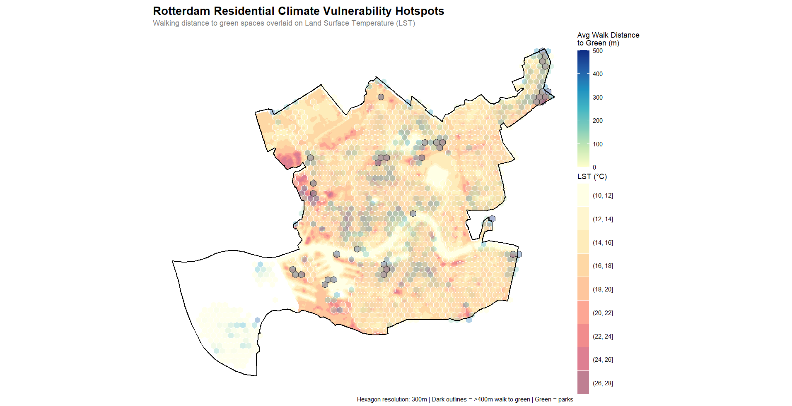
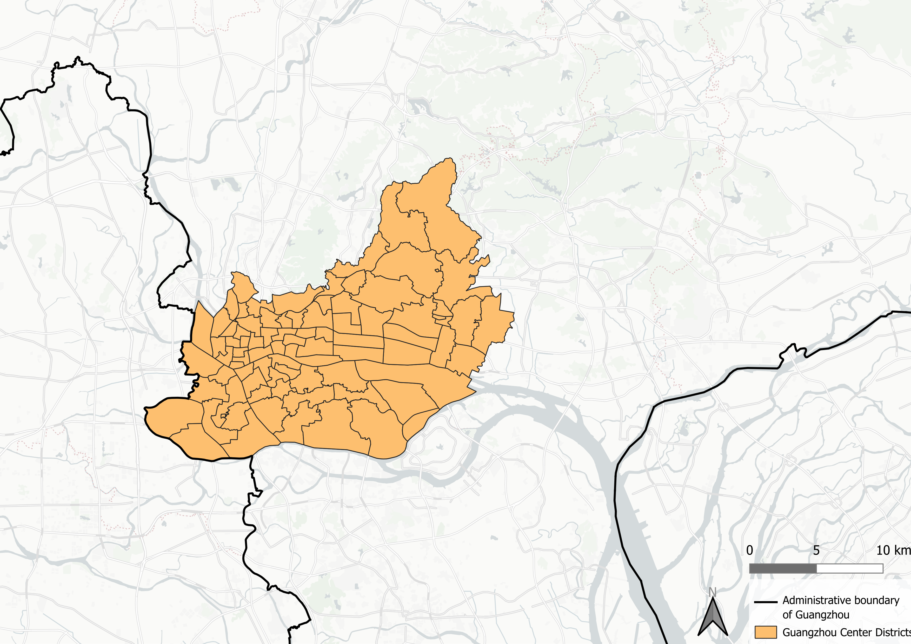
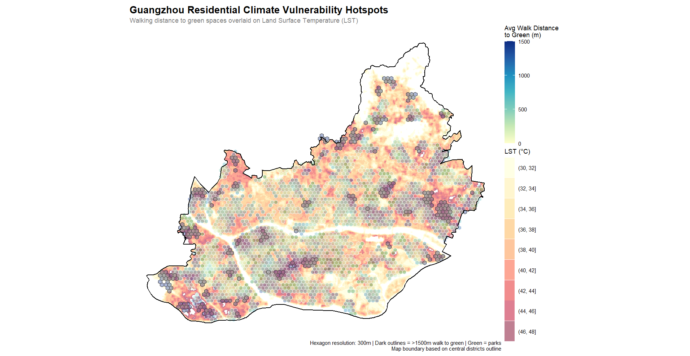

[***We mostly want feedback on the structure of the report / what you think of the complete analysis after we implement the "relationship urban climate and spatial justice" section.***]{.underline}

# Introduction

**TO DO: include references for the claims made in this section (marked in bold)**

Urban environments are increasingly vulnerable to the impacts of climate change, particularly the intensification of the Urban Heat Island (UHI) effect. **Literature suggests** that urban thermal stress is often unevenly distributed across municipal populations, with spatial justice metrics - such as proximity to cooling urban green spaces - aligning with socio-economic disparities. In many metropolitan contexts, **wealthier demographics tend to reside in suburban or highly vegetated neighborhoods** characterized by lower ambient temperatures. Conversely, lower-income or socially vulnerable populations are often **concentrated within dense, highly paved urban cores**, potentially exposing them to elevated thermal conditions and associated health risks. This intersection of micro-climate variation and social equity forms an important challenge for modern urban planning.

As municipal governments seek to adapt, the expansion of urban green infrastructure has emerged as a strategy to mitigate the UHI effect and establish cooling zones. However, assessing whether these interventions genuinely protect vulnerable communities requires a comparative analysis across different urban environments. This research examines the inequality in climate impact between two cities operating on vastly different geographical, demographic, and administrative scales: Rotterdam, a compact European port city, and Guangzhou, a large, dense subtropical city. By comparing these distinct urban frameworks, this study investigates whether the link between socio-economic vulnerability and high heat exposure functions as a universal urban pattern, or if it varies significantly based on local climate zones and governance models. Ultimately, this report aims to evaluate the systemic equity of current climate adaptation strategies by addressing the following primary research question:

**"How does the relationship between urban green infrastructure allocation and socio-economic vulnerability vary between Rotterdam and Guangzhou?"**

In order to get a clear answer to this question, this is divided into two subquestions;

1.  How do the physical and socio-economic criteria of spatial justice correlate with the Land Surface Temperature in each city?
2.  Which neighborhoods exhibit the highest deficit in environmental amenities relative to their vulnerability index, identifying them as priority zones for green adaptation?

This report will first discuss the methodology used to perform the research in both study areas. Secondly, the results for Rotterdam and Guangzhou are presented individually. The subsequent discussion section covers limitations of the data, addresses spatial uncertainties, and directly contrasts findings between the two target cities. Ultimately, the research question is answered in the concluding section, alongside recommendation for equitable urban planning.

# Methodology

<!-- We should probably do a short literature review -->

To evaluate the relationship between urban green infrastructure allocation and socio-economic vulnerability, this study bridges urban climate and social equity by quantifying the urban heat island (UHI) effect alongside several metrics of spatial justice. The methodology is structured as follows: defining the metrics for measuring UHI and spatial justice, explaining the data sources used for the analysis, and integrating these dimensions through a Multi-Criteria Decision Analysis (MCDA) framework.

The UHI effect is a phenomenon where urban areas experience higher temperatures than their rural surroundings. This is the effect of the built environment, which absorbs and retains heat, leading to elevated temperatures in cities. In addition, lack of vegetation and green spaces in cities contribute to this effect due to reduced evapotranspiration and shading. Therefore the presence of green infrastructure is a key factor in mitigating UHI (https://www.sciencedirect.com/science/article/pii/S0169204620301407?via%3Dihub).

Spatial justice concerns the fair distribution of resources, services and environmental benefits across urban space. Therefore, spatial justice can be measured in multiple ways, including socio-economic indicators, such as income, education, and employment, as well as access to green spaces. This study focuses on socio-economic aspects and access to green spaces which can be connected to the UHI effect. By combining these metrics through a Multi-Criteria Decision Analysis (MCDA) framework, the relation between urban climate and spatial justice can be evaluated and compared for Rotterdam and Guangzhou. **TO DO: include reference for spatial justice claims and APA**

## Metrics

<!-- Explain the metrics that will answer the research question -->

## Data Sources

<!-- Explain the data that is used for Rotterdam and Guangzhou and why these are chosen -->

## Multi-Criteria Decision Analysis

Multi-Criteria Decision Analysis (MCDA) is a structured evaluation framework used to solve complex decision and spatial planning problems that involve multiple criteria. It relies on decomposing a complex problem into measurable criteria, normalizing the data to a common scale, applying explicit weights that reflect strategic priorities, and aggregating the results to rank or score geographic alternatives.

Evaluating spatial justice and urban climate adaptation cannot be achieved through a single metric; it requires balancing socio-economic vulnerabilities against environmental and physical urban characteristics. MCDA allows for the simultaneous integration of different datasets by transforming them into a uniform, dimensionless scale. Additionally it allows researchers to embed priorities into the mathematical model via weighting.

The operational workflow for the Spatial Justice Index was executed in four sequential phases; criteria selection, data normalization, weight assignment, and aggregation. In order to get a comprehensive Spatial Justice Index, it was useful to combine multiple criteria into one value. This is where MCDA came in and we were able to normalize all the values and assign different weight to the criteria.

# Results: Rotterdam Case Study

**TO DO: write introduction**

- explain why we deleted the western area (no inhabitants/industrial area)

{#fig-buurten-rotterdam fig-align="center" width="80%"}

## Climate Vulnerability

**TO DO: write introduction - what do we want to find out in this section, why is LST vs distance to green a metric?**

Land Surface Temperature vs. Distance to Green results is plotted as a metric of climate vulnerability. The analysis begins by extracting residential building footprints (woonfunctie). These buildings are spatially joined with a data set (which data set exactly) containing their pre-calculated distance to the nearest "cool spot." Concurrently, a raster map of Land Surface Temperatures is re-projected and cropped to perfectly match the city's residential bounding box. The residential building data is aggregated into a continuous 150-meter hexagonal grid. For each hexagon, the script calculates the average walking distance from the enclosed buildings to the nearest cool space.

Based on the plot shown in @fig-rot-green-lst there is not a clear correlation between distance to green spaces and LST in Rotterdam. The most vulnerable residential spots in terms of accessibility are distributed across both high-heat and moderate-temperature areas. This indicates that poor access to cooling spaces is a structural issue not exclusively isolated to the absolute hottest neighborhoods in the city of Rotterdam.

@wieger Al die hele lichte hexagons zijn niet zo zichtbaar hier (ook omdat de LST kleur daar bijna hetzelfde is) maar misschien toch alles een donkere rand geven? En de gemeente grens van Rotterdam eroverheen is chill. Oh en zorgen dat je alle buurten die hierboven staan op de kaart hebt :)

{#fig-rot-green-lst fig-pos="H" fig-align="center" width="100%"}

## Socio-Economic Vulnerability

To evaluate and visualize the distribution of spatial equity across Rotterdam's neighborhoods, we developed a composite Spatial Justice Index. This index combines multiple dimensions of urban life, ranging from the physical environment to socio-economic status, into a single, standardized metric. Below is a breakdown of the indicators selected, the reasoning behind their inclusion, and the methodology used to combine them.

::: {.callout-note title="Methodological Note on City Comparison"}
While the Rotterdam case study utilizes a multi-dimensional index built from comprehensive national registry data (*Leefbaarometer* and *CBS*), reproducing this exact model for Guangzhou was not feasible due to sparse local data availability. To ensure a reliable comparative analysis, we later adapted our approach by constructing a streamlined Spatial Justice Index tailored to the core socio-economic metrics consistently available for Guangzhou.
:::

### Selected Indicators and Reasoning

We selected seven key indicators derived from the *Leefbaarometer 2024* and *CBS Buurtgegevens*. These indicators were chosen because they capture both the structural quality of the neighborhoods and the socio-economic vulnerability of their residents. They are divided into three main categories:

#### **1. General Livability**

These are metrics of urban well-being. A higher score directly correlates with a more favorable spatial environment.

- Physical Livability Score: Measures the quality of the built environment, housing conditions, and public space.
- Social Livability Score: Reflects social cohesion, safety, and community dynamics.

#### **2. Socio-Economic and Demographic Vulnerability**

In the context of spatial justice, a high concentration of these factors typically points to systemic disadvantages. They highlight areas where residents might have less agency to improve their spatial conditions.

- Percentage of Welfare Recipients: The proportion of residents relying on general welfare (*bijstandsuitkering*). Represents economic hardship and lack of financial capital.
- Percentage of Rental Housing: Indicates a lower rate of homeownership, which is often tied to lower wealth accumulation and higher residential transiency.
- Percentage of Residents 65 and Older: Older populations often face mobility constraints and have higher dependencies on local neighborhood amenities.
- Percentage of Residents with Non-Dutch Heritage: Included as an indicator of systemic vulnerability, as historically marginalized or migrant communities are often disproportionately concentrated in areas with lower spatial quality.

#### **3. Environmental Accessibility**

Access to green space is a fundamental environmental justice issue, impacting mental and physical health. A greater distance signifies poorer accessibility.

- Average Distance to Green Spaces (meters): Measures the physical distance residents must travel to reach parks or nature.

### Data Processing and Combination

To combine these diverse variables (which use different units, such as percentages, absolute scores, and meters) into a single index, we applied a three-step mathematical transformation.

#### **Step 1: Min-Max Normalization**

Every indicator was scaled to a standard range between 0 and 1. This ensures that variables with large numerical values (like distance in meters) do not disproportionately dominate the index compared to smaller values (like percentages). We used the following formula:

$$x_{norm}=\frac{x - x_{min}}{x_{max} - x_{min}}$$

#### **Step 2: Aligning Directionality**

Spatial justice requires all metrics to point in the same direction, where 1 represents the most favorable outcome and 0 represents the least favorable.

- The livability scores (Physical and Social) are positive indicators; their normalized values were kept as is.
- The socio-economic vulnerabilities and distance to green space are negative indicators (e.g., a higher distance to parks is worse for spatial justice). These were inverted by subtracting the normalized score from 1 ($1 - x_{norm}$).

#### **Step 3: Aggregation into the Spatial Justice Index - MCDA**

To evaluate spatial justice across the designated neighborhoods, a weighted Multi-Criteria Decision Analysis (MCDA) framework was implemented. This approach allows for the simultaneous evaluation of diverse spatial, environmental, and socia-economic indicators by assigning explicit weights that reflect their relative importance to the research objectives. In this configuration, the primary analytical focus is placed on the physical and environmental conditions of the urban landscape. Consequently, the physical environment score and the green space accessibility score are prioritized and assigned the highest weight ($w = 2.0$), ensuring that tangible spatial amenities and climate-adaptive features heavily drive the final index.

Conversely, socio-demographic indicators capturing vulnerability - specifically the proportions of elderly residents, citizens born outside the Netherlands, and households relying on welfare - often capture overlapping dimensions of socio-economic vulnerability within the urban fabric. To prevent these closely related variables from artificially dominating the index through redundant compounding, they are down-weighted ($w = 0.5$). The remaining socio-economic and housing dimensions are maintained at a baseline weight ($w=1.0$). The final Multi-Criteria is calculated dynamically for each neighborhood using a normalized weighted average:

$$Spatial Justice Index = \frac{\sum_{i=1}^{n} (S_i \times w_i)}{\sum_{i=1}^{n} (w_i \cdot I_i)}$$

where $S_i$ represents the normalized score for criterion $i$, $w_i$ is its assigned weight, and $I_i$ is an indicator variable equal to 1 if the data is is present and 0 if it is missing ($N A$). This ensures that the final evaluation remains mathematically rigorous, robust to data sparsity, and strictly aligned with our emphasis on physical spatial justice.

::: {.callout-important title="Missing Data Threshold"}
To ensure the index remains statistically robust and representative, a threshold for the amount of inhabitants was implemented. A neighborhood received a valid Spatial Justice Index score only if it has more than 50 inhabitants. Neighborhoods failing to meet this threshold were assigned a null value ($N A$) and are rendered grey on the map.
:::

{#fig-sji-rot-full fig-pos="H" fig-align="center" width="80%"}

### Simplified Spatial Justice Index

**TO DO: make a SJI map with just the values that are also available in Guangzhou**

### I don't know how to call this yet

**TO DO: explain what we can tell from the map**

## Relationship Urban Climate and Spatial Justice

**TO DO: Write introduction to this section**

**TO DO: Make a combined map of Spatial Justice Index and LST**

**TO DO: Describe the process of making the map and what you can tell from it**

# Results: Guangzhou Case Study

Comparing Rotterdam and Guangzhou presents a challenge of scale: Guangzhou's administrative area is more than 200 times larger than Rotterdam's. To make a meaningful cross-continental comparison, we narrowed our scope to Guangzhou's four central urban districts: *Haizhu*, *Liwan*, *Yuexiu*, and *Tianhe*.

These central districts are divided into sub-districts, for which there is data available on population density and mean Land Surface Temperature. The sub-districts are relatively equal in size to the neighborhoods of Rotterdam, making it a comparable set-up.

{#fig-sub-districts fig-pos="H" fig-align="center" width="70%"}

## Climate Vulnerability

::: {.callout-important title="Methodological Adaptation for Guangzhou"}
Since there was no data available for individual residential buildings in Guangzhou, a modified approach was required to create a visualization of climate vulnerability that is comparable to the one of Rotterdam.
:::

In order to retrieve cadastral information of Guangzhou, the relevant OpenStreetMap (OSM) polygons for general residential land use were first queried. To avoid relying on overly large, generalized areas, these polygons were subdivided into a standard 100-meter vector grid, effectively generating smaller raster cells that simulate individual building footprints. In addition, green spaces were identified by extracting multiple vegetation categories, such as forests, parks, and grasslands from OSM.

To facilitate a network analysis determining the distance from each simulated residential building to the nearest green area, pedestrian walking paths were also queried to map the usable routing infrastructure. The network analysis was then executed in R. This script performed a network-based accessibility analysis by converting both the 100-meter residential grid cells and the green spaces into representative origin and destination points. Finally, by utilizing the OSM pedestrian geometries, a routable network graph was constructed to calculate the exact distance a human would need to walk along actual streets and paths to reach the closest park boundary.

**TO DO: Change the paragraphs below because of changing of hexagon size**

After all data had been extracted, the same visualization can be done for Climate vulnerability as for Rotterdam, by plotting the distance to green spaces against the mean land surface temperature (LST). This allows us to visually assess whether areas with higher LST also tend to be farther from green spaces, which would indicate a spatial justice issue in terms of climate vulnerability. In the case of Guangzhou, the hexagons are 500 meter hexagons which is done to make the plot more readable.

Compared to the Rotterdam case, the Guangzhou plot shows a higher overall distance to green spaces, with many residential areas located more than 500 meters away from the nearest park. Additionally, there is a clearer positive correlation between distance to green and LST in Guangzhou, suggesting that residents in hotter areas are also more likely to be farther from cooling green spaces. This pattern indicates a significant spatial justice concern, as vulnerable populations may be disproportionately exposed to heat stress without adequate access to mitigating green infrastructure. This pattern was not so clearly visible for Rotterdam, where the distance to green spaces was generally lower and less strongly correlated with LST, suggesting a more equitable distribution of green infrastructure in relation to heat exposure.

@wieger hier nog de Guangzhou extent aanpassen naar die 4 districts + de outline daarvan erop zetten

{#fig-green-lst-guangzhou fig-pos="H" fig-align="center" width="70%"}

## Socio-Economic Vulnerability

## Relationship Urban Climate and Spatial Justice

# Discussion

```{=html}
<!-- Discuss limitations in data availability, what made it difficult to compare 

Compare how green infrastructure impacts spatial justice in Rotterdam versus Guangzhou -->
```

# Conclusion

```{=html}
<!-- Summarise the main findings

Answer research question -->
```
