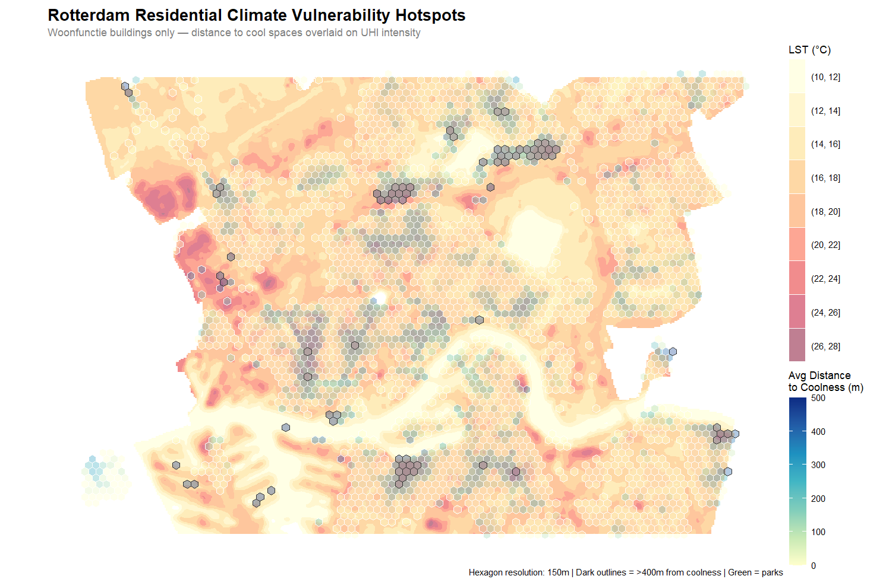
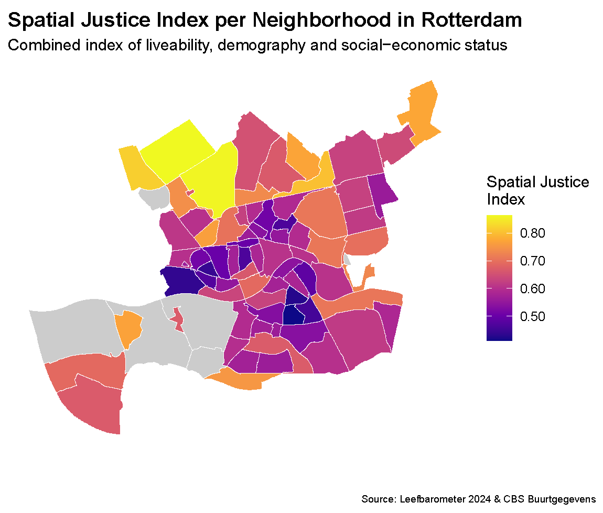
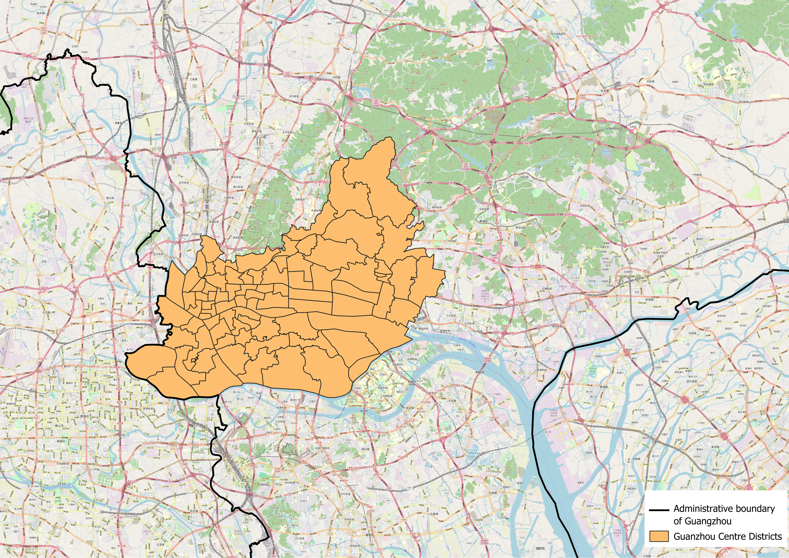
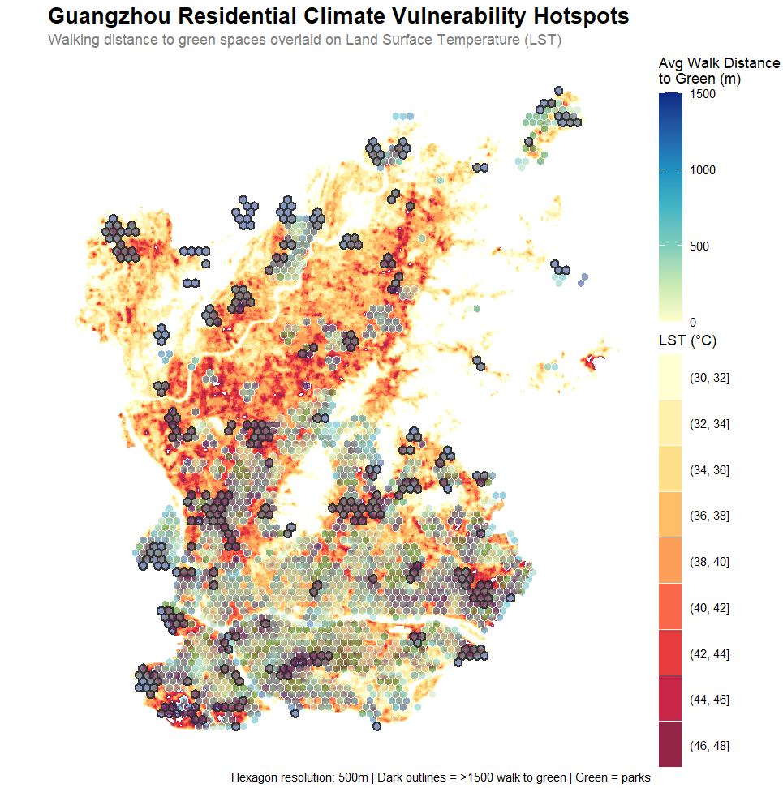

## Introduction

```{=html}
<!-- Introduce the topics of spatial justice and uhi,

Write something about the relevance of this research and problem statement, also why relevant to explore Rotterdam and Guangzhou

Research question: How would expanding urban green infrastructure affect the spatial justice of climate adaptation for vulnerable populations in Rotterdam versus Guangzhou? -->
```

Urban environments are increasingly experiencing climate change, in particular the urban heat island (UHI) effect. The heat in cities is often not evenly distributed across the population. In addition, spatial justice metrics such as, distance to coolness are often tied to socio-economic status, making the intersection of urban climate and social equity a relevant problem. Wealthier demographics often have the capital to live in greener neighborhoods with a lower UHI effect, while low-income or socially vulnerable populations more commonly reside in dense urban areas exposed to intense thermal heat and rising health risks.

As cities seek to adapt, urban green infrastructure has emerged as a strategy to mitigate urban heat island effect and create cooling zones. However, assessing whether these interventions genuinely protect vulnerable populations requires a comparative analysis of different contexts. This research examines the inequality in climate impact between two cities operating on vastly different scales: Rotterdam and Guangzhou. By comparing Rotterdam, a relatively small European port city and Guagzhou, a large subtropical city is highly valuable. This comparison makes it possible to find out if the link between low income and high heat exposure is a global rule, or if it changes depending on how a city is managed. This report aims to evaluate the effectiveness of current adaptation strategies. Ultimately, the research addresses is as follows:

**How would expanding urban green infrastructure affect the spatial justice of climate adaptation for vulnerable populations in Rotterdam versus Guangzhou?**

This report will first dicuss the methods used to perform the research. Than will dicuss the results for Rotterdam and Guangzhou. The discussion covers limitations in the research and compare the results between both cities. Ultimately, the research question is answered in the conclusion.

## Methodology

<!-- Do we need to do a literature review?? -->

<!-- We might need to define spatial typologies and run an S-MCDA, since this is the only lectures they gave?? But not sure it's relevant for our research since we're not looking at what solution is best!?-->

### Metrics

<!-- Expain the metrics that will answer the research question -->

### Data Sources

<!-- Explain the data that is used for Rotterdam and Guangzhou and why these are chosen -->

### MCDA

```{=html}
<!-- 
Not relevant ? -->
```

### Typology construction

<!-- Idem? -->

## Results: Rottedam Case Study

### Climate Vulnerability

Distance to green vs. Land Surface temperature results;

{#fig-plot width="70%" fig-pos="H"}


### Socio-Economic Correlations

::: {.callout-note title="Methodological Note on City Comparison"}
While the Rotterdam case study utilizes a multi-dimensional index built from comprehensive national registry data (*Leefbaarometer* and *CBS*), reproducing this exact model for Guangzhou was not feasible due to sparse local data availability. To ensure a reliable comparative analysis, we later adapted our approach by constructing a streamlined Spatial Justice Index tailored to the core socio-economic metrics consistently available for Guangzhou.
:::

To evaluate and visualize the distribution of spatial equity across Rotterdam's neighborhoods, we developed a composite **Spatial Justice Index**. This index combines multiple dimensions of urban life---ranging from the physical environment to socio-economic status---into a single, standardized metric.

Below is a detailed breakdown of the indicators selected, the rationale behind their inclusion, and the methodology used to combine them.

#### 1. Selected Indicators and Rationale

We selected seven key indicators derived from the *Leefbaarometer 2024* and *CBS Buurtgegevens*. These indicators were chosen because they capture both the structural quality of the neighborhoods and the socio-economic vulnerability of their residents. They are divided into three main categories:

**A. General Liveability**

These are foundational metrics of urban well-being. A higher score directly correlates with a more favorable and just spatial environment.

- **Physical Liveability Score:** Measures the quality of the built environment, housing conditions, and public space.
- **Social Liveability Score:** Reflects social cohesion, safety, and community dynamics.

**B. Socio-Economic and Demographic Vulnerability**

In the context of spatial justice, a high concentration of these factors typically points to systemic disadvantages. They highlight areas where residents might have less agency to improve their spatial conditions.

- **Percentage of Welfare Recipients:** The proportion of residents relying on general welfare (*bijstandsuitkering*). Represents economic hardship and lack of financial capital.
- **Percentage of Rental Housing:** Indicates a lower rate of homeownership, which is often tied to lower wealth accumulation and higher residential transiency.
- **Percentage of Residents 65 and Older:** Older populations often face mobility constraints and have higher dependencies on local neighborhood amenities.
- **Percentage of Residents with Non-Dutch Heritage:** Included as an indicator of systemic vulnerability, as historically marginalized or migrant communities are often disproportionately concentrated in areas with lower spatial quality.

**C. Environmental Accessibility**

Access to green space is a fundamental environmental justice issue, heavily impacting mental and physical health. A greater distance signifies poorer accessibility.

- **Average Distance to Green Spaces (meters):** Measures the physical distance residents must travel to reach parks or nature.

------------------------------------------------------------------------

#### 2. Data Processing and Combination

To combine these diverse variables (which use different units, such as percentages, absolute scores, and meters) into a single index, we applied a three-step mathematical transformation.

**Step 1: Min-Max Normalization**\
Every indicator was scaled to a standard range between 0 and 1. This ensures that variables with large numerical values (like distance in meters) do not disproportionately dominate the index compared to smaller values (like percentages). We used the following formula:

$$x_{norm}=\frac{x - x_{min}}{x_{max} - x_{min}}$$

**Step 2: Aligning Directionality**\
Spatial justice requires all metrics to point in the same direction, where 1 represents the most favorable outcome and 0 represents the least favorable.

- The liveability scores (Physical and Social) are positive indicators; their normalized values were kept as is.
- The socio-economic vulnerabilities and distance to green space are negative indicators (e.g., a higher distance to parks is worse for spatial justice). These were inverted by subtracting the normalized score from 1 ($1 - x_{norm}$).

**Step 3: Aggregation into the Spatial Justice Index**\
Finally, we calculated an unweighted average of the seven adjusted scores for each neighborhood.

::: {.callout-important title="Missing Data Threshold"}
To ensure the index remains statistically robust and representative, a threshold for the amount of inhabitants was implemented. A neighborhood received a valid Spatial Justice Index score only if it has more than 50 inhabitants. Neighborhoods failing to meet this threshold were assigned a null value (`NA`) and are rendered grey on the map.
:::

{#fig-plot width="70%" fig-pos="H"}

### Green Infrastructure Impact

### Micro-Climate Analysis (UMEP)

## Results: Guangzhou Case Study

Comparing Rotterdam and Guangzhou presents an immense challenge of scale: Guangzhou's administrative area is more than 200 times larger than Rotterdam's. To make a meaningful cross-continental comparison, we narrowed our scope to Guangzhou's four central urban districts: \*Haizhu, Liwan, Yuexiu, and Tianhe\*.

However, because these central districts are individually still vastly larger than a standard Rotterdam neighborhood (\*buurt\*), a direct comparison was still geometrically skewed. To resolve this, we manually disaggregated (split) these four districts into smaller, sub-district spatial units using Guangzhou's \*main road networks and the Pearl River\* as geographic boundaries. This brought the spatial footprint of our analytical units down to a size comparable to Rotterdam’s neighborhoods.

While this spatial splitting solved the geometric scaling issue, it introduced a significant bottleneck for data acquisition. Most municipal socio-economic data for Guangzhou is only published at the aggregated district level. Because we split these districts into custom units, matching that coarse data to our finer, road-bounded neighborhoods became exceptionally difficult—a limitation that heavily influenced our spatial justice indexing.

{#fig-plot width="70%" fig-pos="H"}

### Climate Vulnerability

Distance to green vs. Land Surface temperature results;

{#fig-plot width="70%" fig-pos="H"}

### Socio-Economic Correlations

::: {.callout-note title="Methodological Adaptation: Data Consistency"}
To maintain an accurate comparative framework, our analysis proceeds in two steps. We first establish a baseline by describing the ideal, multi-dimensional Spatial Justice Index developed for Rotterdam using dense regional registries. Following this, we outline the specific structural modifications made to simplify this index for Guangzhou—ensuring the two models remain directly comparable despite the sparser data availability in the Chinese context.
:::

#### 1. The Rotterdam Baseline Index

<!-- A very brief 1-2 sentence reminder/transition referencing back to the 7-indicator multi-dimensional index used in the Rotterdam section -->

#### 2. Structural Simplifications for Guangzhou

Due to data scarcity, several variables from the Rotterdam framework were unavailable at the neighborhood scale in Guangzhou. To adapt, we modified the index down to its universally available indicators:

- **Retained Indicators:**
- **Omitted/Substituted Indicators:**

This streamlined approach ensures that while the index is simpler, it tracks the same underlying socio-economic exposure dynamics as the European case study.

### Green Infrastructure Impact

## Discussion

```{=html}
<!-- Discuss limitations in data availability, what made it difficult to compare 

Compare how green infrastructure impacts spatial justice in Rotterdam versus Guangzhou -->
```

## Conclusion

```{=html}
<!-- Summarise the main findings

Answer research question -->
```
